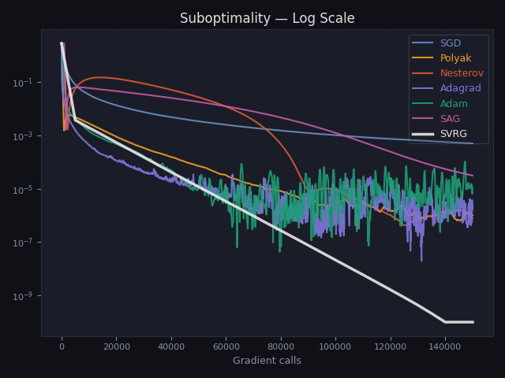
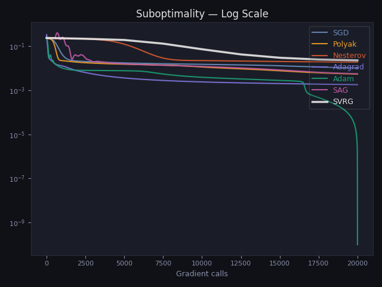

# SGD Variants Benchmark

A from-scratch NumPy implementation of 7 stochastic optimization algorithms, benchmarked across 3 problem classes with gradient-call-normalized comparison and suboptimality analysis.

Built without ML frameworks — every optimizer, backpropagation pass, and convergence plot written from first principles.

---

## Algorithms

| Algorithm | Type | Key idea |
|-----------|------|----------|
| SGD | Baseline | Mini-batch gradient descent |
| Polyak Momentum | Momentum | Velocity accumulation: $v_t = \beta v_{t-1} + \alpha \nabla f_{i}(w)$ |
| Nesterov | Momentum | Gradient at lookahead point: $\nabla f_i(w - \beta v_{t-1})$ |
| AdaGrad | Adaptive | Per-parameter learning rates via $G_t = \sum_s g_s^2$ |
| Adam | Adaptive | Bias-corrected first and second moment estimates |
| SAG | Variance reduction | Gradient table of size $n$, one row updated per step |
| SVRG | Variance reduction | Full gradient snapshot + inner stochastic loop |

---

## Key Results

All comparisons are normalized by **gradient calls** (not iterations) for a fair cost comparison. SVRG computes $n + 2n$ gradient evaluations per step vs $b$ (batch size) for SGD — raw iteration plots would be misleading.

### Linear Regression

<p align="center">
  
</p>

SVRG and SAG achieve **linear convergence** — visible as a straight line on the log scale. SGD-family methods plateau at a noise floor $\sigma^2/(2\alpha)$ regardless of how long they run.
PS : It's important to note that the oscilatory behaviour seen in SAG is due to stale gradients in its gradient table due to it updating only one value per step.
### Logistic Regression

<p align="center">
  
</p>

SVRG converges cleanly. SAG oscillates — the gradient table becomes stale as the loss landscape curvature changes with $w_t$, destabilizing the fixed step size.

For this case SAG doesn't demonstrate true **linear convergence** on the plot since its theoretical linear convergence come from the hypothesis that the target function is strongly convex (strict convexity is not enough) which is not the case for this logistic regression problem.
The addition of L2 regularization ensures that strong convexity but it still will not eliminate the oscilations : these stem from the non linearity of the Hessian : $\nabla^2 f(w) = \frac{1}{n} X^\top DX + \lambda I, D_{ii} = \sigma(x_i^\top w)(1 - \sigma(x_i^\top w))$ unlike in the case of linear regression where the Hessian is $\nabla^2 f(w) = \frac{1}{n} X^\top X$ is fixed (as in "constant"), the logistic Hessian is dependant of $w_t$ through $\sigma(X w_t)$. As $w_t$ changes the smoothness constant $L(w_t)$ changes making the fixed step size calibrated for the initial curvature stale for the curvature changes. This has been proven by calculating the smoothness constant for our specific config, and using the mathematical equation for the learning rate : $\alpha = \frac{1}{16L}$ yields divergence after a certain count of steps even though the learning step is well within safe range of the convergence values, this can be thus explained with a changing $L$ (smoothness constant) value .

### Neural Network (2-layer sigmoid)

<p align="center">
  
</p>

Adam dominates. Variance reduction methods (SVRG, SAG) underperform — their convergence guarantees rely on convexity, which the non-convex NN loss violates (this holds true for all type of activation functions used in this case study which are ReLU, Sigmoid and tanh). Adam's per-parameter adaptivity handles irregular non-convex geometry naturally explaining its vast usability in modern ML frameworks and pipelines as the go to optimization algorithm when it comes to deep learning (since most NNs end up giving non convex and complex geometry). Adam loses to Variance Reduction methods only when it comes to convex geometry.
### Summary

| Problem | Winner | Linear convergence? | Why |
|---------|--------|-------------------|-----|
| Linear regression | SVRG ≈ SAG | ✓ | Strongly convex, fixed curvature |
| Logistic regression | SVRG | ✓ (SAG unstable) | Changing curvature stales SAG table |
| Neural network | Adam | ✗ | Non-convex — variance reduction fails |

---

## Mathematical Background

All problems minimize a finite-sum objective:

$$f(w) = \frac{1}{n} \sum_{i=1}^{n} f_i(w)$$

**Why SGD plateaus.** The mini-batch gradient estimator has irreducible variance $\mathbb{E}\|g_i - \nabla f\|^2 = \sigma^2 > 0$. With constant step size $\alpha$, SGD converges to a neighborhood of $w^*$, not $w^*$ itself. The noise floor scales as $O(\alpha \sigma^2)$.

**The variance reduction idea.** SVRG constructs a control variate:

$$\tilde{g} = \nabla f_{i_k}(w_t) - \nabla f_{i_k}(\tilde{w}) + \nabla f(\tilde{w})$$

where $\tilde{w}$ is a periodic full-gradient snapshot. This estimator is unbiased:

$$\mathbb{E}[\tilde{g}] = \nabla f(w_t)$$

and its variance vanishes as $w_t \to \tilde{w} \to w^*$:

$$\text{Var}(\tilde{g}) = \mathbb{E}\|\nabla f_i(w_t) - \nabla f_i(\tilde{w})\|^2 \xrightarrow{w_t \to w^*} 0$$

This is why SVRG achieves **linear convergence** $\mathbb{E}[f(w_T) - f(w^*)] \leq \rho^T \cdot (f(w_0) - f(w^*))$ with contraction factor $\rho < 1$, while SGD is limited to $O(1/T)$.

**Condition number.** Convergence speed is governed by $\kappa = L/\mu$ where $L$ is the smoothness constant and $\mu$ is the strong convexity constant. The SVRG contraction factor $\rho \approx 1 - 1/(20\kappa)$ — larger $\kappa$ (ill-conditioned problem) means slower convergence for all algorithms.

> Full derivations, convergence proofs, and theorem statements: [`report.pdf`](report.pdf) *(in progress)*

---

## Project Structure

```
sgd-benchmark/
├── optimizers/
│   ├── base.py          # Abstract Optimizer — enforces .step(w, indices, i) interface
│   ├── sgd.py           # SGD · Polyak Momentum · Nesterov (mode-selectable)
│   ├── adagrad.py
│   ├── adam.py          # Supports external gradient injection for NN
│   ├── sag.py           # Gradient table — warm-initialized at w_0
│   └── svrg.py          # Inner/outer loop with full gradient snapshot
├── problems/
│   ├── logistics.py     # Cross-entropy loss + sigmoid gradient
│   ├── linear.py        # L2 loss
│   └── neural.py        # 2-layer NN · sigmoid/ReLU/tanh · flatten interface
├── data.py              # Gaussian blobs + regression data generators
├── config.py            # Per-problem hyperparameters
├── benchmark.py         # Two benchmarks: iteration-based + gradient-call-based
├── plot.py              # visualization suite (6 plot types)
└── outputs/             # Saved figures per problem
```

---

## Setup

```bash
git clone https://github.com/saidane-ma/sgd-benchmark.git
cd sgd-benchmark
pip install numpy matplotlib
```

---

## Usage

```bash
# run all three problems
python benchmark.py

# run a single problem
# edit the last line of benchmark.py:
for problem in ["logistic"]:          # or "Linear", "neural_network" or all three
    run_problem_benchmarks(problem)
```

Outputs are saved to `outputs/<problem>/` as PNG files:

```
outputs/logistic/
├── grad_calls_combined.png    # all optimizers, gradient-normalized x axis
├── grad_calls_log.png         # suboptimality L(w) - L(w*) on log scale
├── grad_calls_grid.png        # individual convergence curves
├── grad_calls_decision.png    # final decision boundaries
├── iterations_wallclock.png   # wall-clock time comparison
└── iterations_clocklog.png    # wall-clock on log scale
```

---

## Implementation Notes

**Fair comparison.** Each optimizer is compared on total gradient evaluations, not iterations. SVRG costs $n + 4 \cdot \text{n\_samples}$ per step; SAG costs 1; SGD/Adam/AdaGrad cost $\text{batch\_size}$.

**Suboptimality metric.** For linear regression, $L(w^*)$ is computed exactly via `np.linalg.lstsq`. For logistic regression and NN, the empirical minimum across all optimizers is used as a proxy.

**SAG initialization.** The gradient table is warm-started by computing $\nabla f_i(w_0)$ for all $i$ before training, avoiding the cold-start bias that would otherwise dominate early convergence.

**Neural network interface.** The NN exposes `gradient(w)` and `loss(w)` on the flattened weight vector $w = [W_1^\top, W_2^\top]^\top$, making it compatible with all optimizers without modification.

---

## Author

**Mohamed Amine Saidane** — ENSTA Paris - Institut Polytechnique de Paris

---

## References

- Bottou et al. (2018). *Optimization Methods for Large-Scale Machine Learning*. SIAM Review.
- Johnson & Zhang (2013). *Accelerating SGD via Variance Reduction*. NeurIPS.
- Schmidt et al. (2013). *Minimizing Finite Sums with the Stochastic Average Gradient*. Mathematical Programming.
- Kingma & Ba (2014). *Adam: A Method for Stochastic Optimization*. ICLR.
- Duchi et al. (2011). *Adaptive Subgradient Methods for Online Learning*. JMLR.